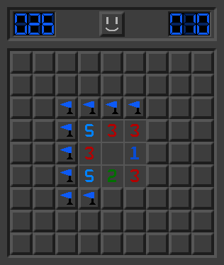
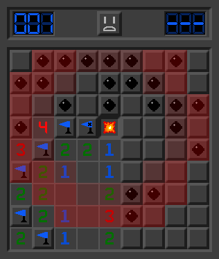
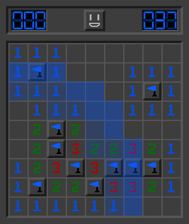

------

Sweepered is a simple clone of minesweeper in Java/JavaFX that I created as a learning project.

All the normal features of Minesweeper are here, along with some of my own personal design choices.

To run it, you can download a [Platform-Specific Jar](https://github.com/OxygenCobalt/Sweepered/releases), or enter the project directory and run the Maven command:

`mvn clean javafx:run`
