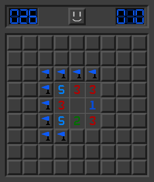
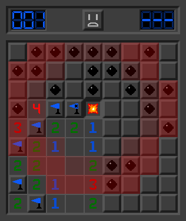
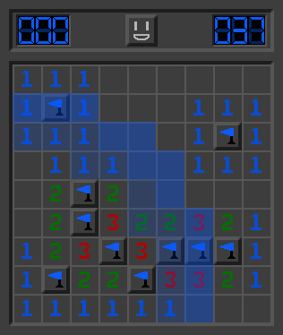

------

Sweepered is a clone of minesweeper in Java/JavaFX that I created as a learning project.

All the normal features of Minesweeper are here, along with some of my own personal design choices.

To run it, enter the project directory and run the Maven command:

`mvn clean javafx:run`
